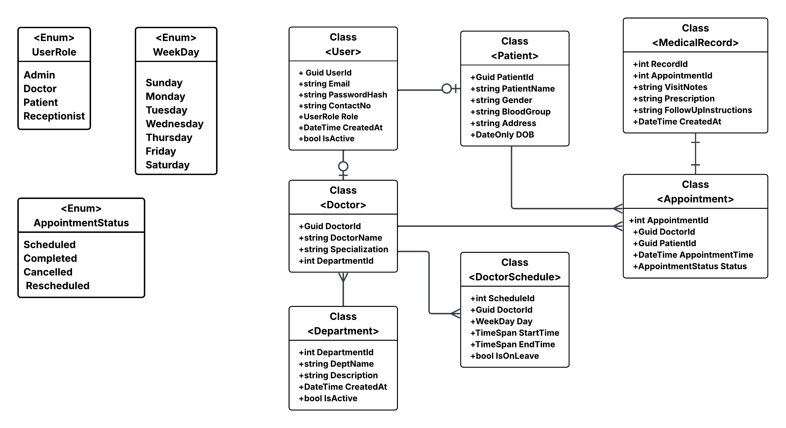

# HAMS (Hospital OPD and Appointment Management System)

**HAMS** (Hospital OPD and Appointment Management System) is a comprehensive system designed to manage hospital operations efficiently. It allows for managing patients, doctors, appointments, medical records, and hospital dashboards in a streamlined way.

---

## 🎯 Key Highlights

- Built with **ASP.NET Core Web API** and **Entity Framework Core**
- **JWT Authentication** for secure access
- **Role-based Access Control** (Admin / Doctor / Patient)
- Modular design for **Patient, Doctor, Appointment, Medical Record, and Reports**
- **SQL Server Database** for reliable data storage
- Advanced features like **Doctor availability, leave tracking, and dashboards**

---
## Class Diagram
> 


---

## ⚙️ Technology Stack

| Layer        | Technology |
|--------------|------------|
| Backend      | ASP.NET Core Web API (C#) |
| Database     | SQL Server |
| ORM          | Entity Framework Core |
| Auth         | JWT Authentication |

---

## 🛠 How It Works

1. **User Login**
   - **Admin**: Manage doctors, patients, appointments, and generate reports
   - **Doctor**: Schedule, availability, leaves, and appointments
   - **Patient**: Appointments and view medical records
2. **Appointment Scheduling**
   - Book, update, or cancel appointments
   - Real-time availability of doctors
3. **Medical Records**
   - Securely store and manage patient medical histories
4. **Reports & Dashboards**
   - Daily appointments, doctor utilization, patient visit frequency, and more

---

## 🚀 Getting Started

1. Clone the repository
   ```bash
   git clone https://github.com/vishalydvv03/HAMS.git
2. Update `appsettings.json` with your database credentials
3. Run the SQL scripts in SQL Server
4. Launch the API project
5. Use Postman or a frontend client to test the endpoints

---

## 📌 Potential Use Cases

- Hospitals and clinics for managing OPD and appointments
- Medical record management systems
- Healthcare dashboards for administrative insights

---

## 🤝 Contributing

1. Fork the project
2. Create a feature branch (`git checkout -b feature-name`)
3. Commit your changes (`git commit -m 'Add feature'`)
4. Push to branch (`git push origin feature-name`)
5. Create a Pull Request

---

## 📜 License

MIT License - Free to use and modify.

---

**📧 Contact:** For collaboration or queries, reach out via GitHub issues.

